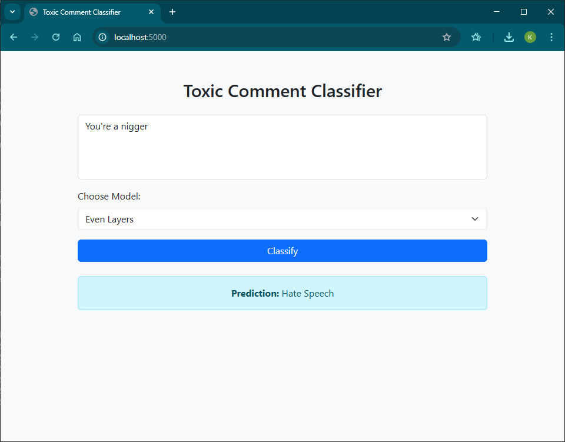
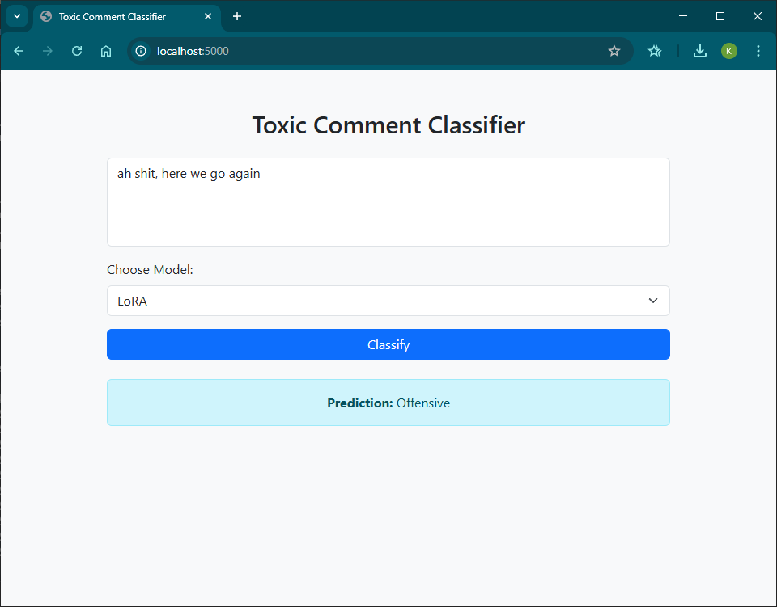
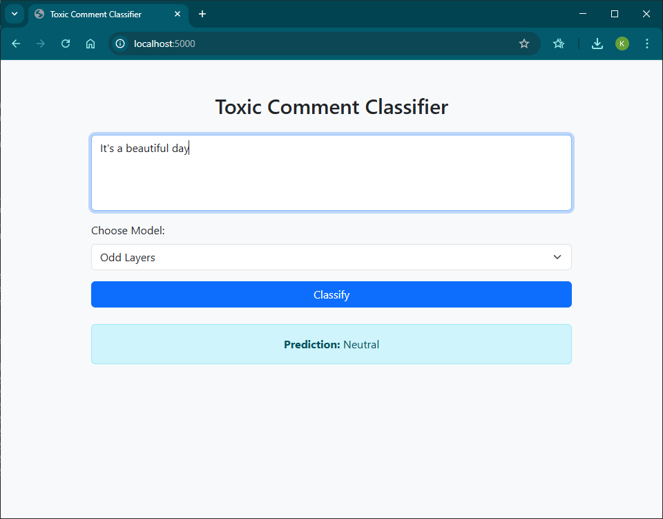

# a7-training-distillation-vs-lora

## Student Information

- Name: Kaung Sithu
- ID: st124974

## Hate Speech/Toxic Comment Dataset

I used the Hate speech offensive tweets by Davidson et al for this assignment. It can be downloaded from this link. <https://www.kaggle.com/datasets/eldrich/hate-speech-offensive-tweets-by-davidson-et-al> The dataset has the following classes for classification:

```json
{
  0: "Hate Speech", 
  1: "Offensive", 
  2: "Neutral"
}
```

## Odd Layer and Even Layer Training

Training the student model using odd and even layers can be found in `distil_odd.ipynb` and `distil_even.ipynb`.

## LoRA (Low-Rank Adaptation)

LoRA student model using 6-layer architecture can be found in `lora.ipynb`.

## Evaluation and Analysis

The evaluation of three models - `Even Layers`, `Odd Layers`, and `LoRA` yielded the following insights:

| Model       |   Train Loss |   Validation Loss |   Test Accuracy |   Test F1-Score |
|:------------|-------------:|------------------:|----------------:|----------------:|
| `Even Layers` |       0.1951 |          0.241774 |        0.915277 |        0.911742 |
| `Odd Layers`  |       0.2011 |          0.250096 |        0.912587 |        0.91048  |
| `LoRA`        |       0.4465 |          0.434195 |        0.842926 |        0.811601 |

I have observed that even-layer model achieved the lowest losses and highest test performance, indicating that even layers retained more transferable knowledge from the teacher. On the other hand, odd-layer model closely followed, showing slightly higher validation loss and marginally lower performance. Although LoRA model is parameter-efficient, it significantly underperformed in all metrics, suggesting a gap in effective knowledge transfer or underfitting.

## Web Application Development

Navigate to the app directory and execute the following command to run the application. Execute the following command:

```bash
python app.py
```

Here are example use case screenshots.







### How the web application interfaces with the model

This Flask-based web application provides an interface for users to input text and classify it as Hate Speech, Offensive, or Neutral using three fine-tuned models, Odd Layers, Even Layers and LoRA (on 6-layer student BERT).

#### Application structure

```csharp
project/
├── app.py                  # flask backend
├── templates/
│   └── index.html          # user_interface
├── static/
│   └── style.css           # styling
├── saved_models/
│   ├── odd_layers/         # Distil 6-layer model
│   ├── even_layers/        # Distil 6-layer model
│   └── lora/               # LoRA 6-layer model

```

#### Life Cycle

1. The user opens the web interface at `localhost:5000/`
2. Inputs a text comment into a text area and selects a model from the dropdown
3. Submits the form via POST request
4. For each POST request, Flask extracts user input and selected model.
5. The selected model is retrieved from the model dictionary
6. Input is tokenized using. Model inference is performed. Finally the predicted label is mapped.
7. The prediction is passed to index.html and displayed inside an alert box.

**_Model Dictionary_**

```python
models = {
    'odd_layers': BertForSequenceClassification.from_pretrained('./saved_models/odd_layers').to(device),
    'even_layers': BertForSequenceClassification.from_pretrained('./saved_models/even_layers').to(device),
    'lora': PeftModel.from_pretrained(
        BertForSequenceClassification.from_pretrained(TEACHER, num_labels=NUM_LABELS),
        './saved_models/lora'
    ).to(device)
}
```
